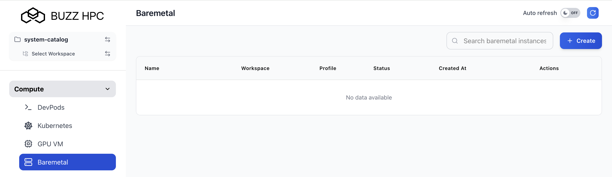
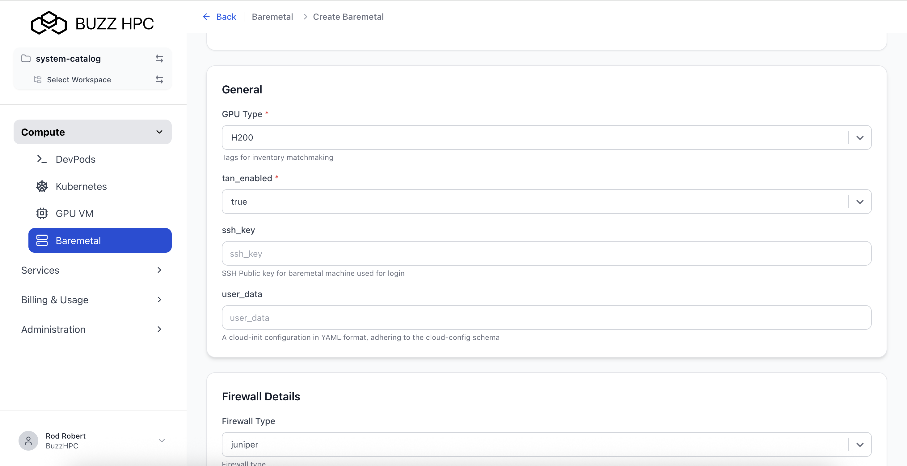
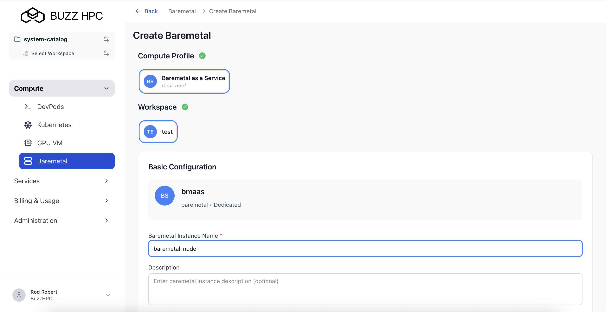
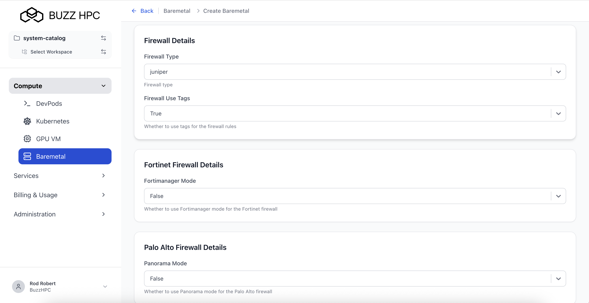
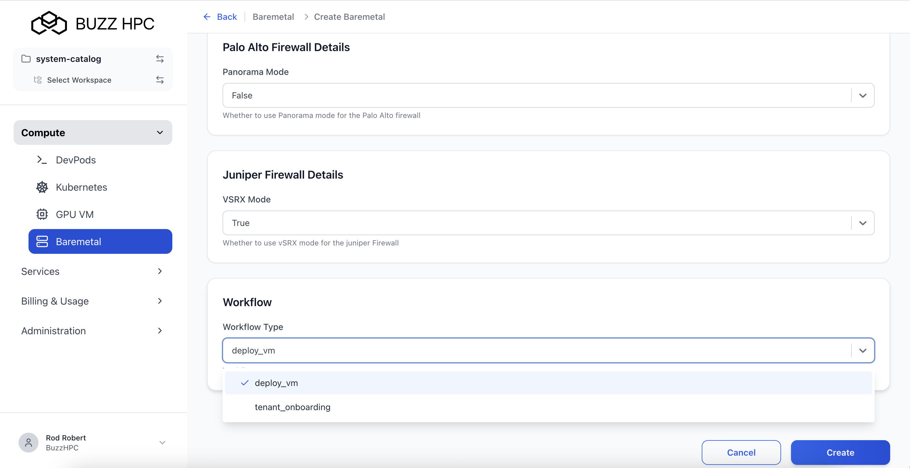

---
title: Baremetal User Guide
description: Step-by-step guide for provisioning Baremetal instances on Buzz HPC.
tags:
  - Baremetal
  -   - Self Service
      - ---

      Users can provision and manage dedicated bare metal GPU servers through the Buzz HPC portal.

      ---

      ## Create Baremetal Instance

      Navigate to **Compute > Baremetal** in the left menu, then click **+ Create**.

      

      ---

      ## Select Compute Profile

      One profile is available: **Baremetal as a Service** (Dedicated) - `bmaas` profile.

      Select the workspace for the instance.

      

      ---

      ## Configure Baremetal Instance

      ### Basic Configuration

      - **Baremetal Instance Name** *(required)* - Unique name (e.g., `my-baremetal-1`)
      - - **Description** *(optional)*
       
        - 
       
        - ---

        ### General Settings

        | Field | Description |
        |-------|-------------|
        | **GPU Type** *(required)* | GPU hardware type for inventory matching. Default: `H200`. |
        | **tan_enabled** *(required)* | Enable Tenant Area Network. Default: `true`. |
        | **ssh_key** | SSH public key for server access. |
        | **user_data** | Cloud-init YAML configuration for automated provisioning at first boot. |

        

        ---

        ### Firewall Details

        | Field | Description |
        |-------|-------------|
        | **Firewall Type** | Options: `juniper`, `fortinet`, `palo_alto`. Default: `juniper`. |
        | **Firewall Use Tags** | Use tags for firewall rules. Default: `True`. |

        

        ---

        ### Vendor-Specific Firewall Settings

        **Fortinet Firewall Details**
        - **Fortimanager Mode** - Enable FortiManager mode. Default: `False`.
       
        - **Palo Alto Firewall Details**
        - - **Panorama Mode** - Enable Panorama management. Default: `False`.
         
          - **Juniper Firewall Details**
          - - **VSRX Mode** - Enable vSRX virtual firewall. Default: `False`.
           
            - 
           
            - ---

            ### Workflow

            | Field | Description |
            |-------|-------------|
            | **Workflow Type** | Provisioning workflow. Default: `deploy_vm`. |

            

            Click **Create** to provision the instance.

            ---

            ## View Baremetal Instances

            All instances listed under **Compute > Baremetal**. Columns: Name, Workspace, Profile, Status, Created At, Actions.

            

            ---

            ## Baremetal Detail View

            Click on an instance name to view details: Name, Workspace, Compute Profile, Compute Type (baremetal), Created At, Status, Reason, Action.

            

            ---

            ## Specification and Stats Panels

            The **Specification** panel shows the current configuration including GPU Type, TAN status, SSH key, user_data, firewall settings, and workflow type.

            The **Stats** panel shows connection information after successful provisioning.

            

            ---

            ## Re-publish

            Click **Re-publish** to re-apply configuration or recover from a failed state.

            ---

            ## Delete

            Click the **delete icon** in the Actions column.

            !!! warning
                Deleting a baremetal instance releases the physical hardware. All data will be lost.

            ---

            ## Cloud-Init Example

            Use the `user_data` field to automate server setup:

            ```yaml
            #cloud-config
            users:
              - name: myuser
                sudo: ALL=(ALL) NOPASSWD:ALL
                ssh_authorized_keys:
                  - ssh-rsa AAAA...your-public-key...
            packages:
              - nvidia-driver-535
            runcmd:
              - nvidia-smi
            ```

            !!! info
                The `user_data` field accepts standard cloud-config YAML (cloud-init format).
            
