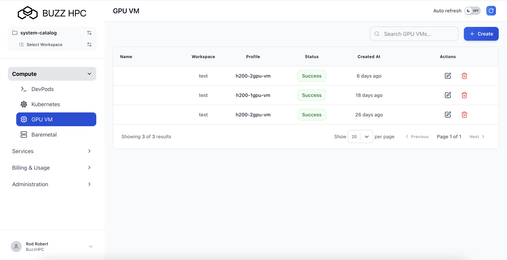
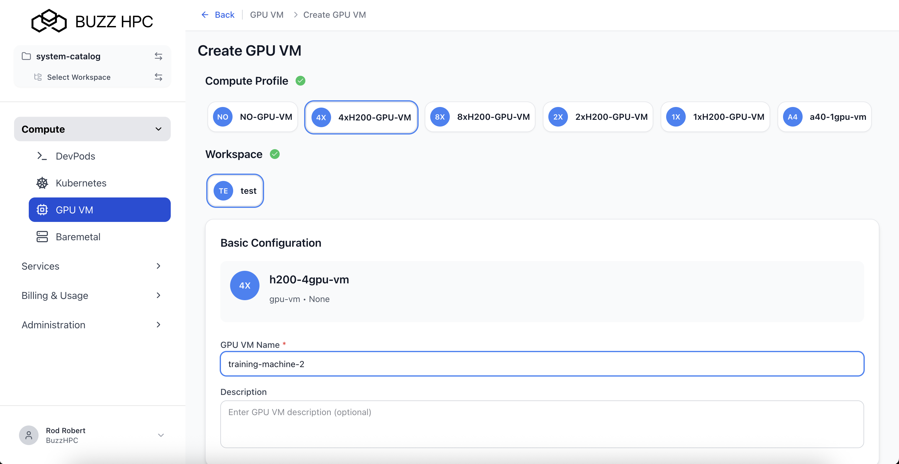
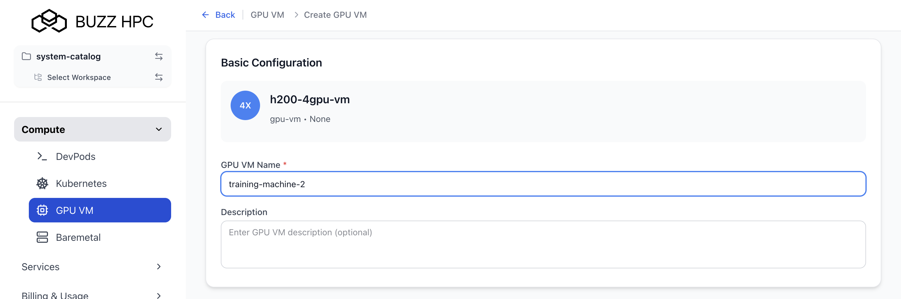
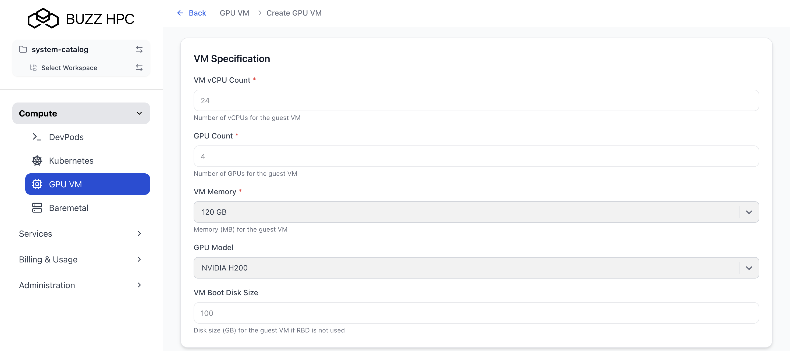
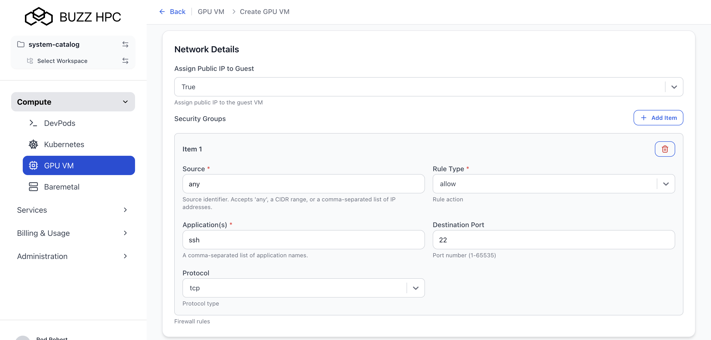
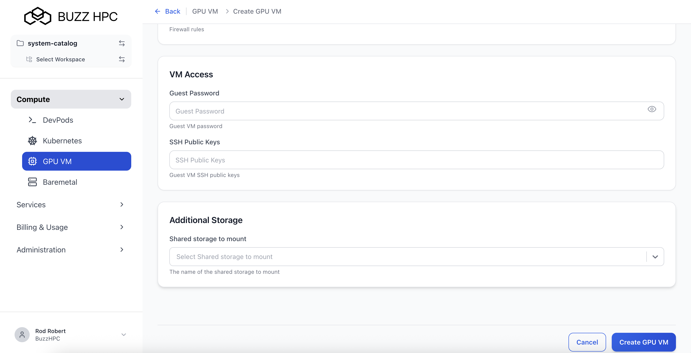
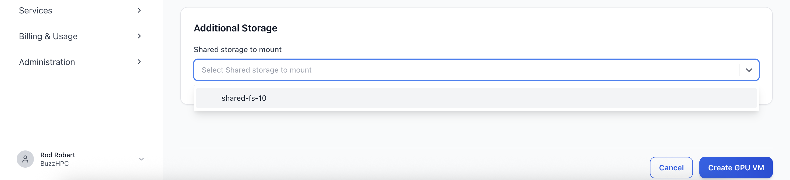
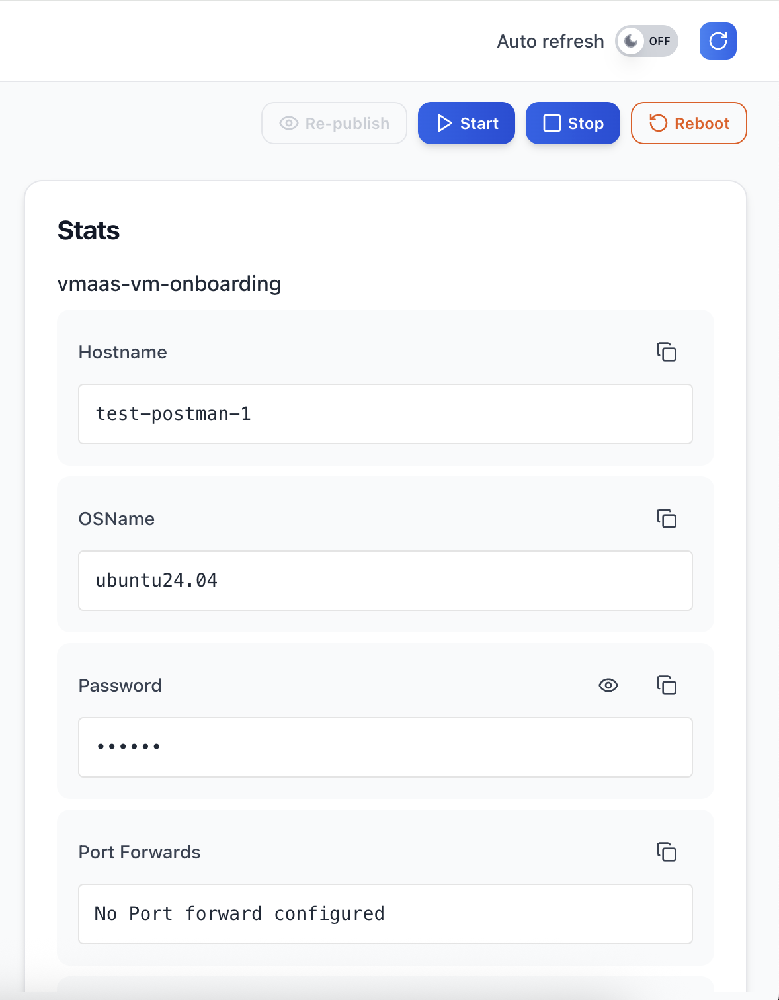
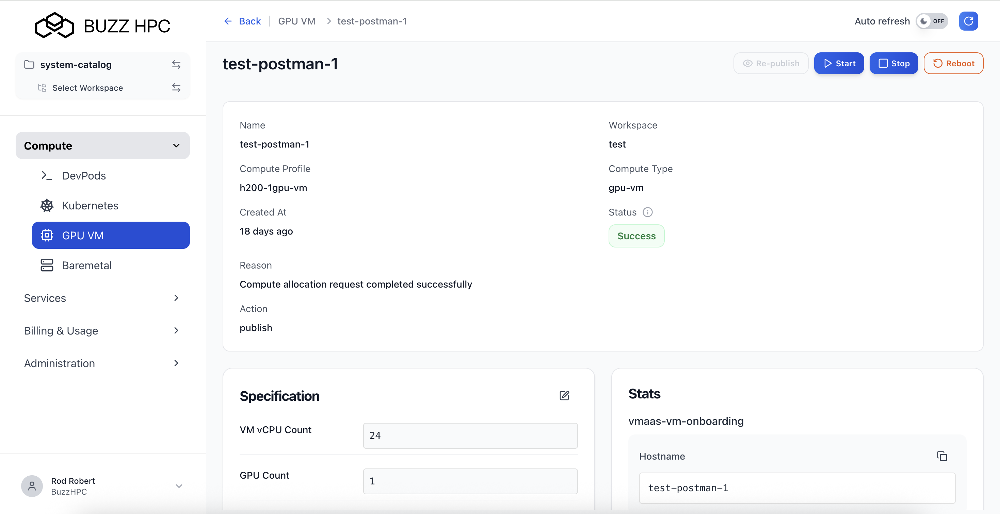
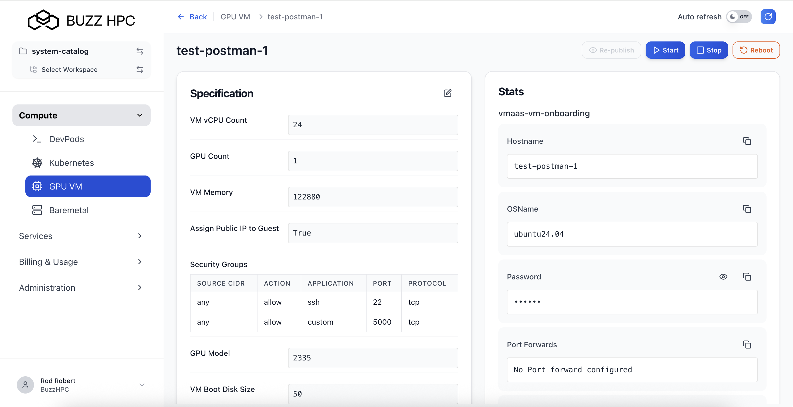

---
title: GPU VM User Guide
description: Step-by-step guide for creating, configuring, and managing GPU Virtual Machines on Buzz HPC.
tags:
  - GPU VM
  -   - Self Service
      - ---

      Users can configure, deploy, and manage GPU-accelerated virtual machines through the Buzz HPC portal.

      ---

      ## Create GPU VM

      Navigate to **Compute > GPU VM** in the left menu, then click **+ Create**.

      

      ---

      ## Select Compute Profile

      Choose a compute profile based on your GPU requirements:

      | Profile | GPUs | GPU Model |
      |---------|------|-----------|
      | NO-GPU-VM | 0 | None |
      | 1xH200-GPU-VM | 1 | NVIDIA H200 |
      | 2xH200-GPU-VM | 2 | NVIDIA H200 |
      | 4xH200-GPU-VM | 4 | NVIDIA H200 |
      | 8xH200-GPU-VM | 8 | NVIDIA H200 |
      | a40-1gpu-vm | 1 | NVIDIA A40 |

      

      ---

      ## Configure GPU VM

      ### Basic Configuration

      - **GPU VM Name** *(required)* - Enter a unique name (e.g., `my-gpu-vm-1`)
      - - **Description** *(optional)*
       
        - 
       
        - ---

        ### VM Specification

        | Field | Description |
        |-------|-------------|
        | **VM vCPU Count** | Number of vCPUs (pre-filled based on profile, e.g., 24 for 4xH200) |
        | **GPU Count** | Number of GPUs (pre-filled based on profile) |
        | **VM Memory** | Memory in GB (e.g., 120 GB) |
        | **GPU Model** | GPU model pre-selected based on profile (e.g., NVIDIA H200) |
        | **VM Boot Disk Size** | Boot disk in GB. Default: 100 GB |

        

        ---

        ### Network Details

        - **Assign Public IP to Guest** - Set to **True** to assign a public IP for external SSH access.
       
        - #### Security Groups (Firewall Rules)
       
        - | Field | Description |
        - |-------|-------------|
        - | **Source** | `any` or CIDR range (e.g., `192.168.1.0/24`) |
        - | **Rule Type** | `allow` or `deny` |
        - | **Application(s)** | Application name (e.g., `ssh`) |
        - | **Destination Port** | Port number (e.g., `22`) |
        - | **Protocol** | `tcp` or `udp` |
       
        - Click **+ Add Item** to add more rules.
       
        - 
       
        - ---

        ### VM Access

        - **Guest Password** - Set the VM guest password for console or fallback SSH access.
        - - **SSH Public Keys** - Enter SSH public key(s) for passwordless SSH access.
         
          - 
         
          - ---

          ### Additional Storage

          - **Shared storage to mount** - Optionally attach a shared storage volume.
         
          - 
         
          - Click **Create** to provision the GPU VM.
         
          - ---

          ## View GPU VMs

          All GPU VMs are listed under **Compute > GPU VM**. Columns: Name, Workspace, Profile, Status, Created At, Actions.

          

          ---

          ## GPU VM Detail View

          Click on a GPU VM name to view its full details and connection information.

          The detail view shows Name, Workspace, Compute Profile, Compute Type (gpu-vm), Created At, Status, Reason, and Action.

          

          ---

          ## VM Controls

          Three lifecycle action buttons appear at the top of the detail view:

          | Button | Description |
          |--------|-------------|
          | **Start** | Start a stopped GPU VM |
          | **Stop** | Gracefully stop a running GPU VM |
          | **Reboot** | Restart the GPU VM |

          

          ---

          ## Specification Panel

          Shows the current VM configuration: Guest CPU Count, Guest GPU Count, Guest Memory Size, Assign Public IP to Guest, Firewall Rules, GPU Model, Guest Disk Size, Guest Password (masked), SSH Public Keys, Shared storage to mount.

          The pencil icon allows editing the specification.

          

          ---

          ## Stats Panel

          Provides connection information for the running VM:

          | Field | Description |
          |-------|-------------|
          | **VM Name** | VM identifier |
          | **OSName** | OS (e.g., ubuntu24.04) |
          | **Password** | Guest password (masked - click eye icon) |
          | **Port Forwards** | Forwarding rules ("No Port forward configured" if none) |
          | **Private IP** | Internal IP (masked - click eye icon) |
          | **Public IP** | External IP (masked - click eye icon) |
          | **ServerHost** | Physical host identifier |
          | **Username** | Default: `ubuntu` |

          ### Connecting via SSH

          ```bash
          ssh ubuntu@<public-ip>
          ```

          With SSH key:
          ```bash
          ssh -i ~/.ssh/your_private_key ubuntu@<public-ip>
          ```

          

          ---

          ## Re-publish GPU VM

          Click **Re-publish** to re-apply the VM configuration or recover from a failed state.

          ---

          ## Delete GPU VM

          Click the **delete icon** in the Actions column.

          !!! warning
              Deleting a GPU VM is permanent. All boot disk data will be lost. Back up important data before deleting.
          
