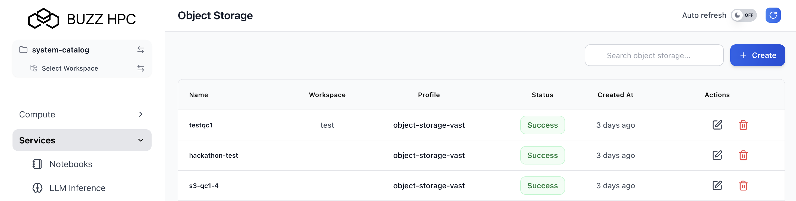

Users can provision, configure, and access S3-compatible object storage through the Buzz HPC platform.

---

## Create Object Storage Instance

Navigate to **Services > Object Storage** in the left menu, then click **+ Create** (or **New Object Storage**).



---

## Configure Object Storage

### Basic Configuration

- **Name** *(required)* - Unique identifier for your user and bucket instance (e.g., `obj-test-demo`)
- **Description** *(optional)* - Add a description
- **Workspace** - Select target workspace


---

### Quota Configuration

| Field | Description |
|-------|-------------|
| **Bucket Size (GB)** | Storage capacity quota for the bucket |

Set the bucket size quota based on your storage requirements.


Click **Deploy** to create the instance.

---

## What Happens on Deployment

When you click Deploy, the system automatically:

1. Creates an S3 user account
2. Provisions a dedicated bucket
3. Generates Access Key and Secret Key credentials
4. Configures API endpoints

---

## View Deployed Instances

Once deployed, all Object Storage instances are listed under **Services > Object Storage**:

| Column | Description |
|--------|-------------|
| **Name** | Instance identifier |
| **Workspace** | Associated workspace |
| **Bucket Name** | Auto-generated bucket name |
| **Quota (GB)** | Storage capacity |
| **Status** | Success, Pending, Failed, or Cancelled |
| **Created At** | Creation time |
| **Actions** | View, Edit, or Delete |


---

## Instance Details and Credentials

Click on an instance name to view the detail page, which displays:

### Output Information

| Field | Description |
|-------|-------------|
| **Bucket Name** | Your S3 bucket name (e.g., `obj-s3-demo-c57as`) |
| **Bucket Location** | Bucket path |
| **Access Key** | S3 access key ID |
| **Secret** | S3 secret access key (masked - click eye icon to reveal) |
| **S3 URL** | S3 API endpoint (e.g., `https://10.201.14.179`) |
| **Deployment Status** | Success indicator |


!!! warning
    **Important**: Copy and securely store these credentials. You will need them to configure S3 clients and applications.

---

## Browser-Based File Management

You can browse, upload, and download files directly through the web interface:

### Upload Files

1. Click the **Upload** button
2. Select files from your computer
3. Files are uploaded to your bucket

### Browse Files

- View all objects in your bucket
- Navigate folders/prefixes
- View object metadata (size, last modified, etc.)

### Download Files

- Click on an object to download
- Right-click for additional options

### Delete Files

- Select objects
- Click delete to remove from bucket


---

## Accessing via Command-Line (s3cmd)

### Installation

Install s3cmd using your package manager:

```bash
# Debian/Ubuntu
sudo apt install s3cmd

# macOS (Homebrew)
brew install s3cmd

# CentOS/RHEL
sudo yum install s3cmd
```

---

### Configuration

Create or edit `~/.s3cfg` with your credentials:

```ini
[default]
access_key = YOUR_ACCESS_KEY
secret_key = YOUR_SECRET_KEY
host_base = 10.201.14.179
use_https = True
host_bucket = 10.201.14.179:%(bucket)
check_ssl_certificate = False
signature_v2 = False
```

Replace `YOUR_ACCESS_KEY` and `YOUR_SECRET_KEY` with the credentials from your instance detail page.

---

### Common s3cmd Operations

| Operation | Command |
|-----------|---------|
| List buckets | `s3cmd ls` |
| Upload file | `s3cmd put <file> s3://<bucket>/` |
| List objects | `s3cmd ls s3://<bucket>/` |
| Download file | `s3cmd get s3://<bucket>/<file>` |
| Delete file | `s3cmd del s3://<bucket>/<file>` |

### Example Session

```bash
# List your buckets
$ s3cmd ls
2025-10-24 16:41  s3://obj-s3-demo-c57as

# Upload a file
$ s3cmd put test-file.txt s3://obj-s3-demo-c57as/
upload: 'test-file.txt' -> 's3://obj-s3-demo-c57as/test-file.txt'  [1 of 1]
33 of 33   100% in    0s  1484.08 B/s  done

# List objects in bucket
$ s3cmd ls s3://obj-s3-demo-c57as/
2025-10-24 16:42        33   s3://obj-s3-demo-c57as/test-file.txt
```

---

## Programmatic Access with boto3

### Installation

Install the AWS SDK for Python:

```bash
pip install boto3
```

---

### Client Initialization

Initialize the S3 client with your custom endpoint and credentials:

```python
import boto3
from botocore.client import Config
import urllib3

# Disable SSL warnings (for development)
urllib3.disable_warnings(urllib3.exceptions.InsecureRequestWarning)

# Configuration
ENDPOINT_URL = "https://10.201.14.179"
ACCESS_KEY = "YOUR_ACCESS_KEY"
SECRET_KEY = "YOUR_SECRET_KEY"
BUCKET_NAME = "obj-s3-demo-c57as"

# Create S3 client
s3 = boto3.client(
    's3',
    endpoint_url=ENDPOINT_URL,
    aws_access_key_id=ACCESS_KEY,
    aws_secret_access_key=SECRET_KEY,
    config=Config(signature_version='s3v4'),
    verify=False
)
```

!!! note
    Replace `YOUR_ACCESS_KEY`, `YOUR_SECRET_KEY`, and bucket name with your actual credentials from the instance detail page.

---

### List Buckets

```python
response = s3.list_buckets()
for bucket in response['Buckets']:
    print(f" - {bucket['Name']}")
```

**Output:**
```
- obj-s3-demo-c57as
```

---

### Upload Object

```python
test_file = "demo-test.txt"
content = "Hello from S3 demo!"

s3.put_object(
    Bucket=BUCKET_NAME,
    Key=test_file,
    Body=content.encode()
)

print(f"Uploaded: {test_file}")
```

**Output:**
```
Uploaded: demo-test.txt
```

---

### List Objects

```python
response = s3.list_objects_v2(Bucket=BUCKET_NAME)

if 'Contents' in response:
    for obj in response['Contents']:
        print(f"{obj['Key']} - {obj['Size']} bytes")
```

---

### Download Object

```python
response = s3.get_object(Bucket=BUCKET_NAME, Key=test_file)
content = response['Body'].read().decode()
print(f"Content: {content}")
```

**Output:**
```
Content: Hello from S3 demo!
```

---

### Delete Object

```python
s3.delete_object(Bucket=BUCKET_NAME, Key=test_file)
print(f"Deleted: {test_file}")
```

**Output:**
```
Deleted: demo-test.txt
```

---

## boto3 Quick Reference

| Operation | Method | Description |
|-----------|--------|-------------|
| List Buckets | `s3.list_buckets()` | Get all available buckets |
| Upload Object | `s3.put_object()` | Upload file to bucket |
| List Objects | `s3.list_objects_v2()` | List contents of bucket |
| Download Object | `s3.get_object()` | Retrieve file from bucket |
| Delete Object | `s3.delete_object()` | Remove file from bucket |
| Get Metadata | `s3.head_object()` | Get object metadata without downloading |

---

## Delete Object Storage Instance

Click the **delete icon** in the Actions column to delete an Object Storage instance.

!!! danger
    **Warning**: Deleting an Object Storage instance permanently removes:
    - The bucket and all objects
    - Access credentials
    - All stored data

    Ensure data is backed up before deletion.

---

## Best Practices

### Security

- Store credentials securely (use environment variables or secret managers)
- Rotate access keys regularly
- Use HTTPS endpoints
- Apply least-privilege access policies

### Performance

- Use multipart uploads for large files (>100MB)
- Enable connection pooling for high-volume operations
- Batch operations when possible

### Cost Optimization

- Set appropriate quotas
- Delete unused objects
- Monitor storage usage regularly

### Data Management

- Use meaningful object key naming conventions
- Organize objects with prefixes (pseudo-folders)
- Tag objects for categorization
- Implement lifecycle policies for archival

---

## Additional Resources

- **Boto3 Documentation**: [https://boto3.amazonaws.com/v1/documentation/api/latest/reference/services/s3.html](https://boto3.amazonaws.com/v1/documentation/api/latest/reference/services/s3.html)
- **S3cmd Documentation**: [https://s3tools.org/s3cmd](https://s3tools.org/s3cmd)
- **AWS S3 API Reference**: [https://docs.aws.amazon.com/AmazonS3/latest/API/Welcome.html](https://docs.aws.amazon.com/AmazonS3/latest/API/Welcome.html)

---
